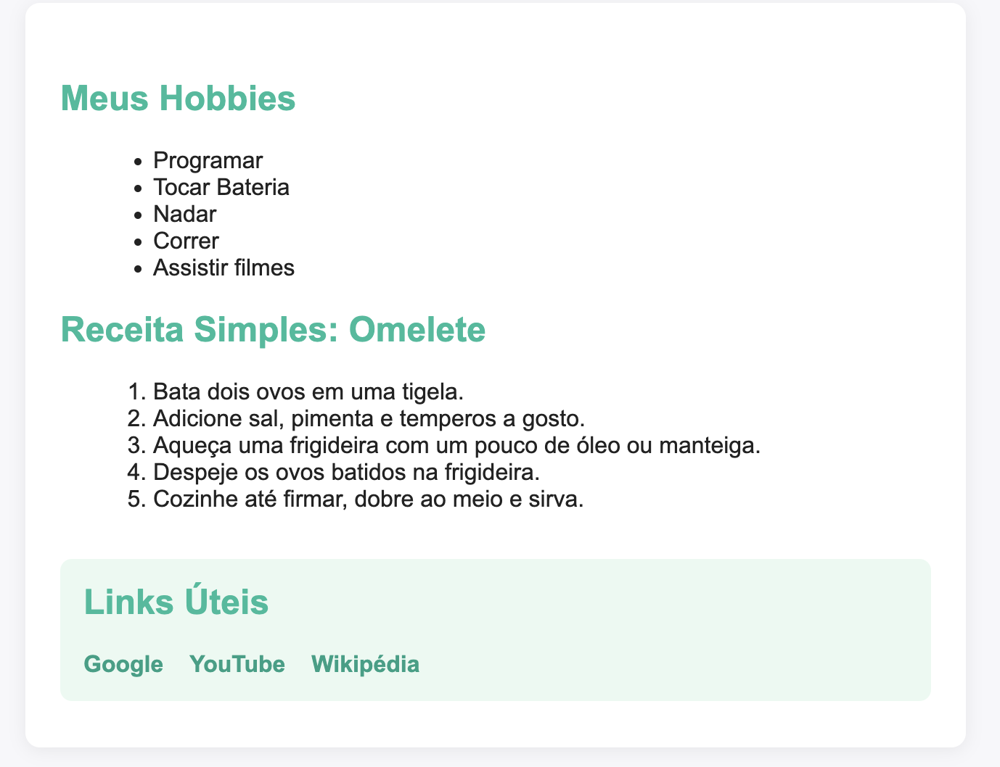
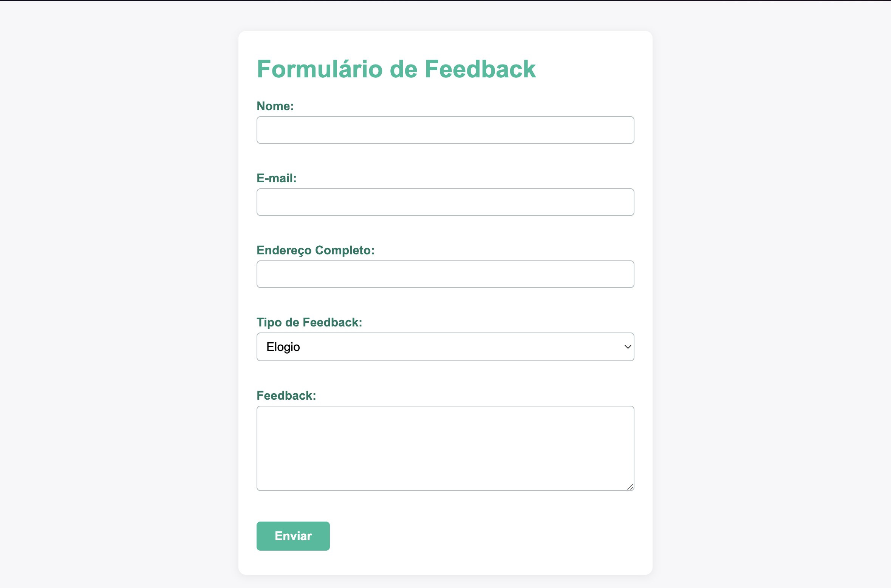

# Exercícios de HTML e CSS

## index.html
Página institucional com estrutura semântica, incluindo header, main (Missão e Visão), footer, galeria de imagens com Grid e Flexbox, menu de navegação e menu hamburger responsivo. Estilização feita via CSS externo.

## listas.html
Contém listas de hobbies (não ordenada), passos de uma receita (ordenada) e um bloco de navegação com links externos. Possui estilização interna para melhor visualização das listas e navegação.

## feedback.html
Formulário de feedback com campos para nome, e-mail, endereço, tipo de feedback e mensagem. Estilização interna para layout agradável e responsivo.

## Preview dos projetos

### listas.html

### feedback.html

